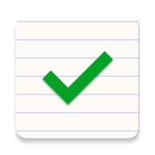
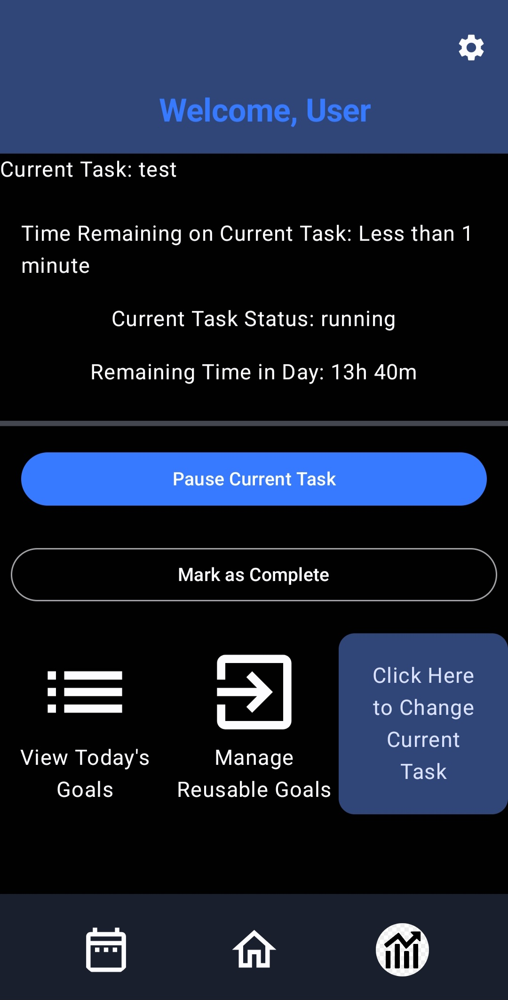
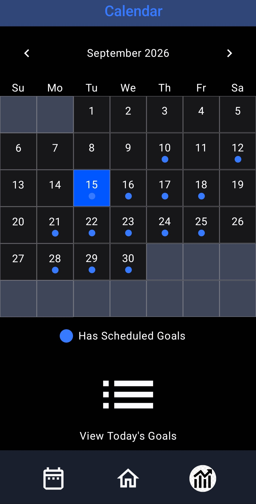
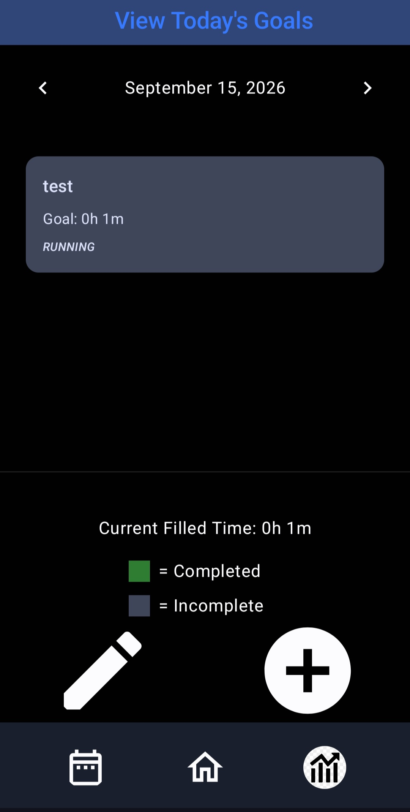
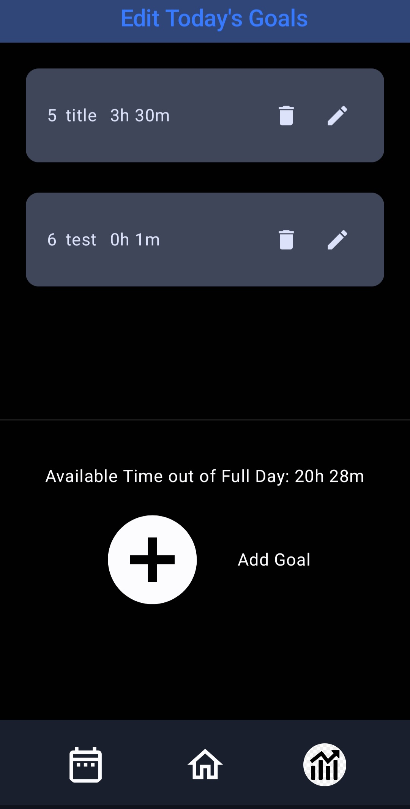
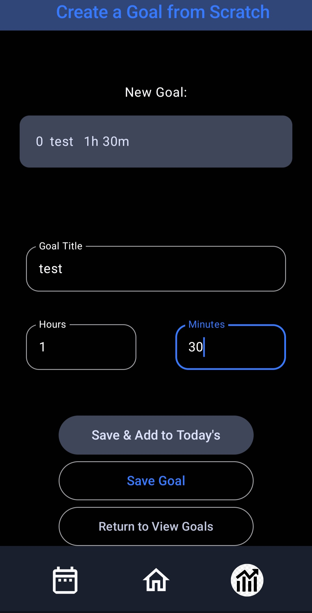
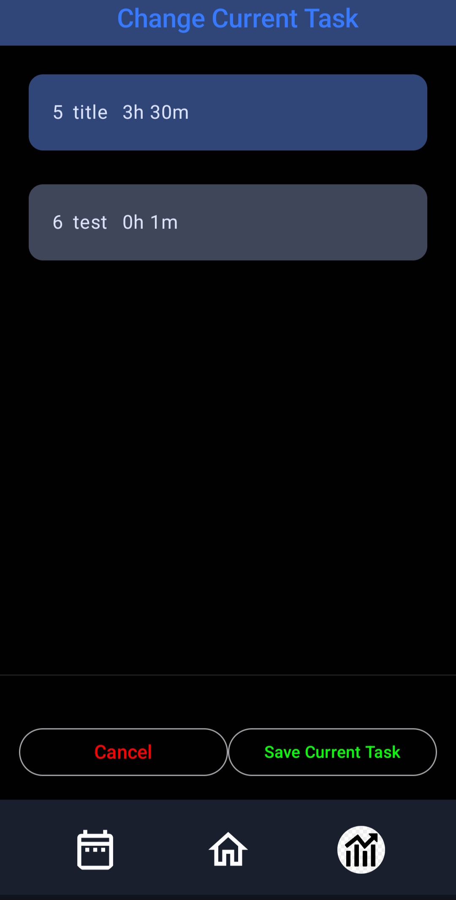
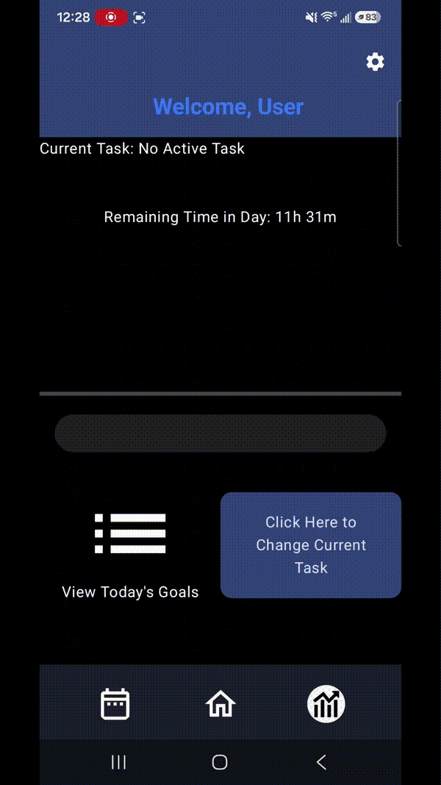

# Timely


> Timely is an Android productivity application that helps users manage their time wisely by organizing goals within the limited time available each day.
---

## 💡 Motivation

Have you ever found yourself wondering where all your time went? It's easy to spend more time than intended on one activity and neglect to complete other important tasks. Timely was created to encourage intentional time management by treating time as a limited resource. Users can create reusable goals, assign realistic durations, and schedule them throughout the day while seeing exactly how much time remains available. By providing a clear visual representation of each day's schedule, Timely helps users build achievable plans and make more informed decisions about how they spend their time.

---
## Features

### Current Features

- Create reusable time goals
- Edit scheduled goals
- Delete scheduled goals
- Schedule goals for specific dates
- View daily schedule
- Navigate between days
- Current task time tracking
- Current task pause/resume
- Current task completed notifications
- Local data persistence
- Material Design 3 UI

### Planned Features

- [ ] Analytics dashboard
- [ ] Custom themes
- [ ] Notifications & reminders
- [ ] Goal completion history
- [ ] Recurring goals
- [ ] Cloud backup

---

## 📸 Screenshots

| Home                                   | Calendar                        |
|----------------------------------------|---------------------------------|
|  |  |

| View Goals                             | Edit Goals                      |
|----------------------------------------|---------------------------------|
|  |  |

| Create Goal                            | Current Task                    |
|----------------------------------------|---------------------------------|
|  |  |
---

## 🎥 Demo



Link To Full Demo Video
[Timely Demo Video (Youtube)](https://youtu.be/0Wy609OTCPI)
---

## 🛠️ Built With

- Kotlin
- Jetpack Compose
- Material 3
- Room Database (SQLite)
- MVVM Architecture
- Kotlin Coroutines
- StateFlow
- Navigation Compose
- DataStore Preferences

---

## 🏗️ Architecture

The application follows the **MVVM (Model–View–ViewModel)** architecture using a repository pattern and reactive UI state.

```text
UI (Jetpack Compose)
        │
        ▼
    ViewModels
        │
        ▼
   Repositories
        │
        ▼
   Room Database
```

---

## 📂 Project Structure

```text
app/src/main/java/com/example/timemanagementapp
├── data/
│   ├── alarm/
│   ├── calendar/
│   └── goal/
│   └── scheduledgoal/
│   └── AppContainer.kt
│   └── Converters.kt
│   └── TestData.kt
│   └── UserPreferencesRepository.kt
│
├── receiver/
│   └── TimerReceiver.kt
│
├── ui/
│   ├── add/
│   ├── calendar/
│   ├── components/
│   └── createGoal/
│   └── currenttask/
│   └── edit/
│   └── goal/
│   └── home/
│   └── navigation/
│   └── theme/
│   └── viewgoals/
│   └── AppViewModelProvider.kt
│
├── util/
├── MainActivity.kt
├── TimelyApp.kt
└── TimelyApplication.kt 
```
* **data/** - Contains Room entities, DAOs, repositories, alarm logic, dependency providers, and user .preferences

* **receiver/** - Contains Android broadcast receivers used for current task alarm events.

* **ui/** - Contains Jetpack Compose Screens, reusable composable components, ViewModels, navigation, and theme components.

* **util/** - Contains shared utility functions and helper classes

* **MainActivity.kt** - Hosts the Compose application.

* **TimelyApp.kt** - Defines root UI and navigation structure.

* **TimelyApplication** - Initializes application-wide dependencies.
---

## 🚀 Getting Started

### Prerequisites

- Android Studio
- JDK 17+
- Android SDK

### Installation

```bash
git clone https://github.com/dylanrambo26/timely-app.git
```

Open the project in Android Studio and run it on an emulator or Android device.

---

## 📖 Usage

1. Create reusable goal templates with a title and estimated duration.
2. Select a date to view or plan your schedule.
3. Add existing goal templates to the selected day or create new ones from scratch.
4. Track the remaining available time as goals are scheduled.
5. Modify or remove scheduled goals as your plans change.
6. Select a goal to be tracked as the current task you are working on.
7. When your task time is up, it will notify you it is complete.
8. View goals to see complete and incomplete goals to see what to work on next.

---

## 🗺️ Roadmap

### ✅ Completed

- [x] Reusable Goals
- [x] Scheduled Goals
- [x] Daily scheduling
- [x] Current task time tracking
- [x] Current task notifications
- [x] Remaining time calculation
- [x] Navigation between screens

### 🚧 In Progress

- [ ] Analytics page

### 📅 Planned

- [ ] Analytics Dashboard
- [ ] Custom themes
- [ ] Notification reminders
- [ ] Recurring goals
- [ ] Goal completion history
- [ ] Cloud sync & backup

---

## 📄 License

This project is licensed under the MIT License.

---

## 👤 Author

**Dylan Rambo**

- GitHub: https://[github.com/dylanrambo26](https://github.com/dylanrambo26)
- LinkedIn: https://[linkedin.com/in/dylan-rambo-4b80b4353/](https://www.linkedin.com/in/dylan-rambo-4b80b4353/)